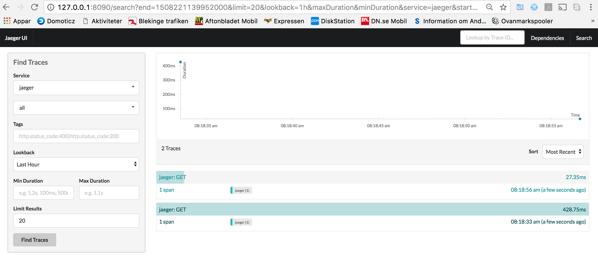

:toc:

= Java EE application using MySQL with WildFly Swarm

This repo has a simple Java EE application that publishes a REST endpoint at `/resources/employees`. The resource returns a list of employees by querying a database.

The Java EE application is deployed as a JAR built using http://wildfly-swarm.io/[WildFly Swarm]. MySQL is used as the backend database.

The application also publishes Prometheus-style metrics at `/metrics`.

== Build application

Build Docker image

  mvn -f employees/pom.xml clean package -Pdocker

Docker image used in this application, `arungupta/docker-javaee:dockerconeu17`, is already published at Docker Hub.

== Run application

=== Using Docker Compose on Swarm mode

  docker stack deploy --compose-file=docker-compose.yml webapp

Verify:

```
$ docker stack ls
NAME                SERVICES
webapp              2
$ docker stack services webapp
ID                  NAME                MODE                REPLICAS            IMAGE                                   PORTS
9tuwp1o2sz4j        webapp_web          replicated          1/1                 arungupta/docker-javaee:dockerconeu17   *:8080->8080/tcp,*:9990->9990/tcp
jy6qyaxv5e01        webapp_db           replicated          1/1                 mysql:8                                 *:3306->3306/tcp
$ docker stack ps webapp
ID                  NAME                IMAGE                                   NODE                DESIRED STATE       CURRENT STATE           ERROR               PORTS
lbnyvncsnfad        webapp_web.1        arungupta/docker-javaee:dockerconeu17   moby                Running             Running 7 seconds ago                       
r7j0q1nx1y1q        webapp_db.1         mysql:8                                 moby                Running             Running 9 seconds ago            
```

=== Using Kubernetes 

The application is available as Kubernetes Helm chart in the link:app[app] directory. Install Helm client and server, and then the application.

Install Helm client and server:

  brew install kubernetes-helm
  helm init

Install Helm chart:

  helm install --name app app

Verify:

```
$ kubectl get deployments
NAME                DESIRED   CURRENT   UP-TO-DATE   AVAILABLE   AGE
mysql-deployment    1         1         1            1           1m
webapp-deployment   1         1         1            1           1m
$ kubectl get svc
NAME         TYPE        CLUSTER-IP       EXTERNAL-IP   PORT(S)    AGE
db           ClusterIP   100.65.195.189   <none>        3306/TCP   1m
kubernetes   ClusterIP   100.64.0.1       <none>        443/TCP    1h
webapp       ClusterIP   100.71.21.2      <none>        8080/TCP   1m
$ kubectl get pods
NAME                                READY     STATUS    RESTARTS   AGE
mysql-deployment-1668503186-9h7lz   1/1       Running   0          1m
webapp-deployment-372583675-hlcbg   1/1       Running   0          1m
```

== Access application

=== Using Docker

Access the application:

  curl http://localhost:8080/resources/employees

The output is shown as:

  <?xml version="1.0" encoding="UTF-8" standalone="yes"?><collection><employee><id>1</id><name>Penny</name></employee><employee><id>2</id><name>Sheldon</name></employee><employee><id>3</id><name>Amy</name></employee><employee><id>4</id><name>Leonard</name></employee><employee><id>5</id><name>Bernadette</name></employee><employee><id>6</id><name>Raj</name></employee><employee><id>7</id><name>Howard</name></employee><employee><id>8</id><name>Priya</name></employee></collection>

JSON output can be obtained as:

  curl -H"Accept: application/json" http://localhost:8080/resources/employees

The output is shown as:

  [{"id":1,"name":"Penny"},{"id":2,"name":"Sheldon"},{"id":3,"name":"Amy"},{"id":4,"name":"Leonard"},{"id":5,"name":"Bernadette"},{"id":6,"name":"Raj"},{"id":7,"name":"Howard"},{"id":8,"name":"Priya"}]

=== Using Kubernetes

Start proxy:

    kubectl proxy

Access the application:

    curl http://localhost:8001/api/v1/proxy/namespaces/default/services/webapp/resources/employees

== Debug

=== Using Docker

. Check the service logs

  docker service logs webapp_web

. Remove the application

  docker stack rm webapp

=== Using Kubernetes

. Check the service logs

  kubectl logs <pod-id>

. Remove the application

  helm delete app

== Prometheus-style metrics

Get application metrics as:

```
$ curl http://localhost:8080/metrics
# HELP jvm_threads_current Current thread count of a JVM
# TYPE jvm_threads_current gauge
jvm_threads_current 105.0
# HELP jvm_threads_daemon Daemon thread count of a JVM
# TYPE jvm_threads_daemon gauge
jvm_threads_daemon 12.0
# HELP jvm_threads_peak Peak thread count of a JVM
# TYPE jvm_threads_peak gauge
jvm_threads_peak 105.0
# HELP jvm_threads_started_total Started thread count of a JVM
# TYPE jvm_threads_started_total counter
jvm_threads_started_total 138.0
# HELP jvm_threads_deadlocked Cycles of JVM-threads that are in deadlock waiting to acquire object monitors or ownable synchronizers
# TYPE jvm_threads_deadlocked gauge
jvm_threads_deadlocked 0.0
# HELP jvm_threads_deadlocked_monitor Cycles of JVM-threads that are in deadlock waiting to acquire object monitors
# TYPE jvm_threads_deadlocked_monitor gauge
jvm_threads_deadlocked_monitor 0.0
# HELP requests_get_one Total GET /{id} requests.
# TYPE requests_get_one counter
requests_get_one 7.0
# HELP requests_get_all Total GET / requests.
# TYPE requests_get_all counter
requests_get_all 14.0
# HELP jvm_memory_bytes_used Used bytes of a given JVM memory area.
# TYPE jvm_memory_bytes_used gauge
jvm_memory_bytes_used{area="heap",} 1.01012128E8
jvm_memory_bytes_used{area="nonheap",} 1.00972688E8
# HELP jvm_memory_bytes_committed Committed (bytes) of a given JVM memory area.
# TYPE jvm_memory_bytes_committed gauge
jvm_memory_bytes_committed{area="heap",} 2.87309824E8
jvm_memory_bytes_committed{area="nonheap",} 1.08756992E8
# HELP jvm_memory_bytes_max Max (bytes) of a given JVM memory area.
# TYPE jvm_memory_bytes_max gauge
jvm_memory_bytes_max{area="heap",} 4.66092032E8
jvm_memory_bytes_max{area="nonheap",} -1.0
# HELP jvm_memory_pool_bytes_used Used bytes of a given JVM memory pool.
# TYPE jvm_memory_pool_bytes_used gauge
jvm_memory_pool_bytes_used{pool="Code Cache",} 1.7550848E7
jvm_memory_pool_bytes_used{pool="Metaspace",} 7.3989384E7
jvm_memory_pool_bytes_used{pool="Compressed Class Space",} 9432456.0
jvm_memory_pool_bytes_used{pool="PS Eden Space",} 3191200.0
jvm_memory_pool_bytes_used{pool="PS Survivor Space",} 2408464.0
jvm_memory_pool_bytes_used{pool="PS Old Gen",} 9.5412464E7
# HELP jvm_memory_pool_bytes_committed Committed bytes of a given JVM memory pool.
# TYPE jvm_memory_pool_bytes_committed gauge
jvm_memory_pool_bytes_committed{pool="Code Cache",} 1.769472E7
jvm_memory_pool_bytes_committed{pool="Metaspace",} 7.9740928E7
jvm_memory_pool_bytes_committed{pool="Compressed Class Space",} 1.1321344E7
jvm_memory_pool_bytes_committed{pool="PS Eden Space",} 7.602176E7
jvm_memory_pool_bytes_committed{pool="PS Survivor Space",} 4.8234496E7
jvm_memory_pool_bytes_committed{pool="PS Old Gen",} 1.63053568E8
# HELP jvm_memory_pool_bytes_max Max bytes of a given JVM memory pool.
# TYPE jvm_memory_pool_bytes_max gauge
jvm_memory_pool_bytes_max{pool="Code Cache",} 2.5165824E8
jvm_memory_pool_bytes_max{pool="Metaspace",} -1.0
jvm_memory_pool_bytes_max{pool="Compressed Class Space",} 1.073741824E9
jvm_memory_pool_bytes_max{pool="PS Eden Space",} 7.8118912E7
jvm_memory_pool_bytes_max{pool="PS Survivor Space",} 4.8234496E7
jvm_memory_pool_bytes_max{pool="PS Old Gen",} 3.49700096E8
# HELP jvm_classes_loaded The number of classes that are currently loaded in the JVM
# TYPE jvm_classes_loaded gauge
jvm_classes_loaded 13797.0
# HELP jvm_classes_loaded_total The total number of classes that have been loaded since the JVM has started execution
# TYPE jvm_classes_loaded_total counter
jvm_classes_loaded_total 13797.0
# HELP jvm_classes_unloaded_total The total number of classes that have been unloaded since the JVM has started execution
# TYPE jvm_classes_unloaded_total counter
jvm_classes_unloaded_total 0.0
# HELP jvm_info JVM version info
# TYPE jvm_info gauge
jvm_info{version="1.8.0_141-8u141-b15-1~deb9u1-b15",vendor="Oracle Corporation",} 1.0
# HELP app_metrics The time taken fulfilling servlet requests
# TYPE app_metrics histogram
app_metrics_bucket{path="/resources",method="GET",le="0.005",} 13.0
app_metrics_bucket{path="/resources",method="GET",le="0.01",} 17.0
app_metrics_bucket{path="/resources",method="GET",le="0.025",} 20.0
app_metrics_bucket{path="/resources",method="GET",le="0.05",} 20.0
app_metrics_bucket{path="/resources",method="GET",le="0.075",} 20.0
app_metrics_bucket{path="/resources",method="GET",le="0.1",} 20.0
app_metrics_bucket{path="/resources",method="GET",le="0.25",} 21.0
app_metrics_bucket{path="/resources",method="GET",le="0.5",} 21.0
app_metrics_bucket{path="/resources",method="GET",le="0.75",} 21.0
app_metrics_bucket{path="/resources",method="GET",le="1.0",} 21.0
app_metrics_bucket{path="/resources",method="GET",le="2.5",} 21.0
app_metrics_bucket{path="/resources",method="GET",le="5.0",} 21.0
app_metrics_bucket{path="/resources",method="GET",le="7.5",} 21.0
app_metrics_bucket{path="/resources",method="GET",le="10.0",} 21.0
app_metrics_bucket{path="/resources",method="GET",le="+Inf",} 21.0
app_metrics_count{path="/resources",method="GET",} 21.0
app_metrics_sum{path="/resources",method="GET",} 0.3544065799999999
# HELP process_cpu_seconds_total Total user and system CPU time spent in seconds.
# TYPE process_cpu_seconds_total counter
process_cpu_seconds_total 44.43
# HELP process_start_time_seconds Start time of the process since unix epoch in seconds.
# TYPE process_start_time_seconds gauge
process_start_time_seconds 1.508062328635E9
# HELP process_open_fds Number of open file descriptors.
# TYPE process_open_fds gauge
process_open_fds 500.0
# HELP process_max_fds Maximum number of open file descriptors.
# TYPE process_max_fds gauge
process_max_fds 1048576.0
# HELP process_virtual_memory_bytes Virtual memory size in bytes.
# TYPE process_virtual_memory_bytes gauge
process_virtual_memory_bytes 4.289380352E9
# HELP process_resident_memory_bytes Resident memory size in bytes.
# TYPE process_resident_memory_bytes gauge
process_resident_memory_bytes 5.36694784E8
# HELP jvm_gc_collection_seconds Time spent in a given JVM garbage collector in seconds.
# TYPE jvm_gc_collection_seconds summary
jvm_gc_collection_seconds_count{gc="PS Scavenge",} 28.0
jvm_gc_collection_seconds_sum{gc="PS Scavenge",} 0.373
jvm_gc_collection_seconds_count{gc="PS MarkSweep",} 6.0
jvm_gc_collection_seconds_sum{gc="PS MarkSweep",} 0.565
```

== OpenTracing/Jaeger
The application traces all requests to Jaeger (https://uber.github.io/jaeger/) and the result can be viewed on http://127.0.0.1:8090. 




